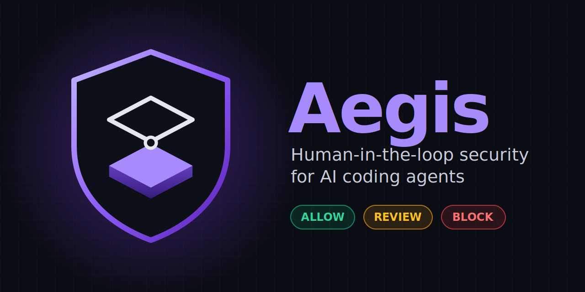
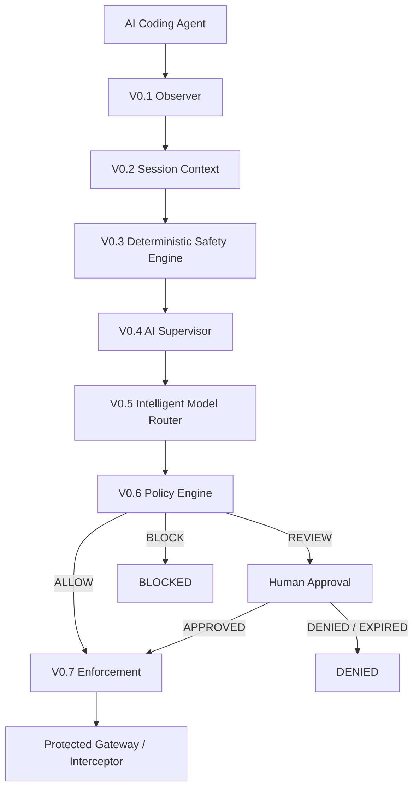
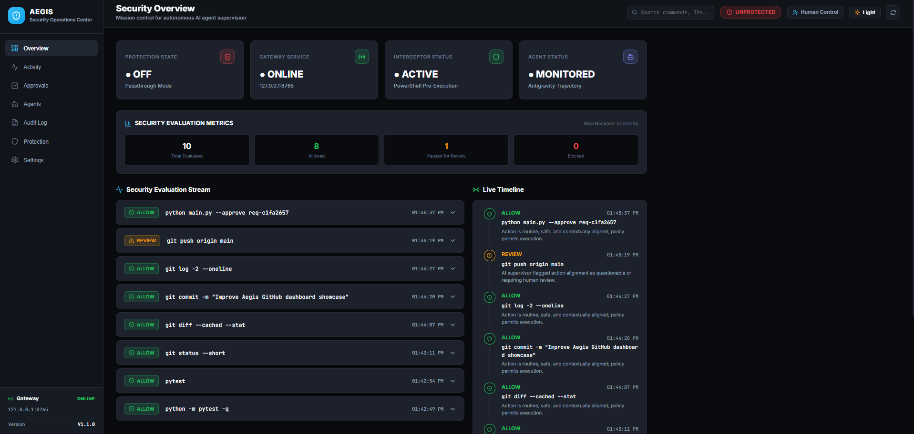
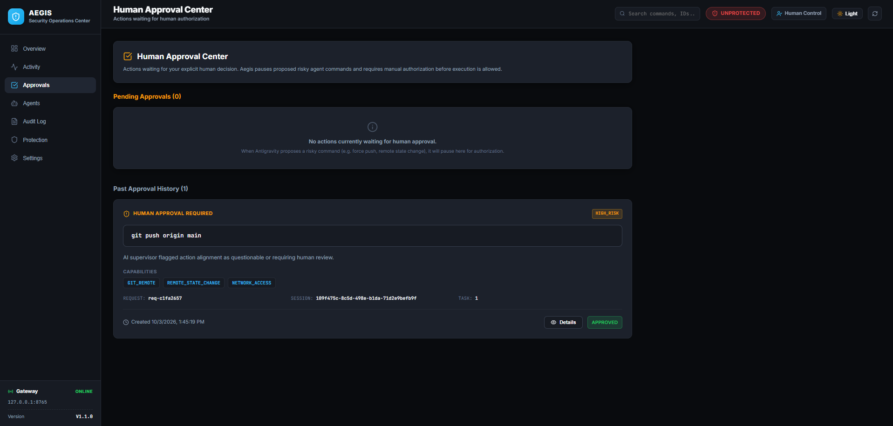
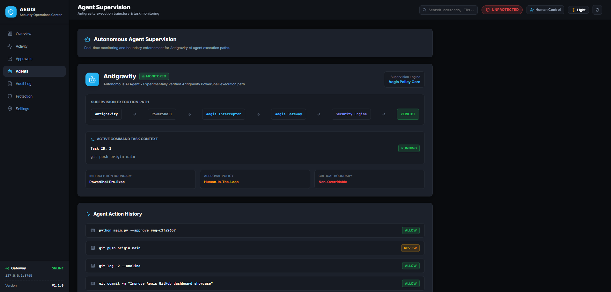
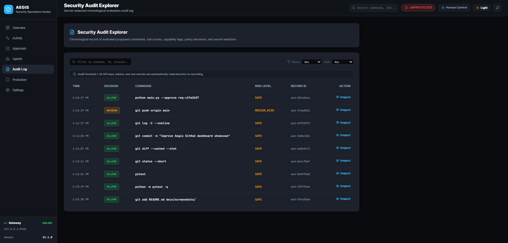
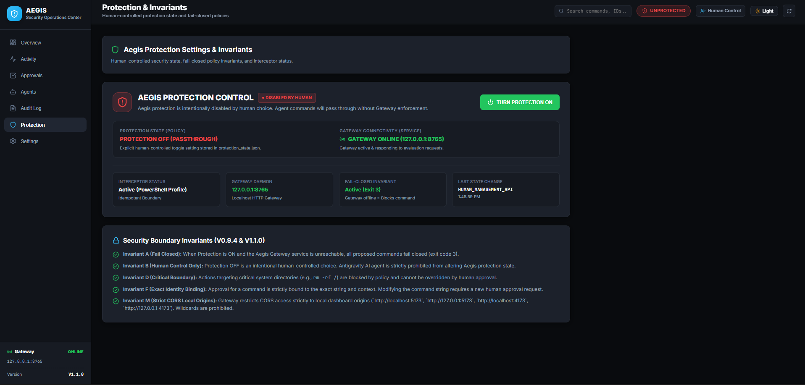

# Aegis

### Human-in-the-Loop Security Layer for AI Coding Agents

<p align="center">
  
</p>

<p align="center">
  <strong>Observe. Analyze. Decide. Enforce.</strong><br>
  A local security supervision layer for autonomous AI coding agents.
</p>

<p align="center">
  
  
  
</p>

---

## What is Aegis?

Aegis is a local security supervision layer designed to supervise AI coding-agent activity.

It observes agent activity, analyzes command risk and contextual alignment, applies deterministic security policy, and introduces a human approval checkpoint for risky actions while allowing safe project-relevant operations to proceed automatically.

The goal is simple:

> **Let AI coding agents work autonomously without giving them unrestricted authority over the machine.**

Aegis is designed as a local developer-tool governance boundary. It is **not** a kernel-level sandbox, hypervisor, or process-isolation driver.

---

## Why Aegis?

AI coding agents can execute commands autonomously while working on software projects.

A security layer therefore needs to distinguish between:

- routine development operations that should not interrupt the developer,
- actions that deserve explicit human authorization,
- and fundamentally dangerous operations that should never be approved.

Aegis uses a three-level decision model:

| Decision | Meaning |
|---|---|
| 🟢 **ALLOW** | Safe operation permitted automatically |
| 🟠 **REVIEW** | Execution paused until explicit human approval |
| 🔴 **BLOCK** | Operation rejected by a non-overridable security policy |

This is designed to reduce approval fatigue without giving the agent unrestricted execution authority.

---

# Security Architecture



### Decision Flow

```text
AI Coding Agent
       │
       ▼
   Observe
       │
       ▼
Analyze command + context
       │
       ├───────────────┐
       ▼               ▼
     SAFE            RISKY
       │               │
       ▼               ▼
    ALLOW            REVIEW
       │               │
       │          Human approval
       │               │
       │        ┌──────┴──────┐
       │        ▼             ▼
       │    APPROVED        DENIED
       │        │
       └────────┴──────► ENFORCE

Critical / prohibited actions
              │
              ▼
            BLOCK
```

---

# Dashboard

Aegis includes a local Security Operations Center (SOC) dashboard built with React, TypeScript, and Vite.

The dashboard provides visibility into:

- Gateway and protection status
- Antigravity supervision
- Human approval requests
- Command risk
- Security capabilities
- Audit events
- Protection state
- Agent activity

## SOC Overview

<p align="center">
  
</p>

## Human Approval Center

<p align="center">
  
</p>

## Agent Supervision

<p align="center">
  
</p>

## Security Audit Explorer

<p align="center">
  
</p>

## Protection & Security State

<p align="center">
  
</p>

---

# Core Features

### Real-Time Agent Supervision

Observes activity from the verified Antigravity execution path and feeds relevant events into the Aegis supervision pipeline.

### Deterministic Risk Analysis

Analyzes command structure, arguments, capabilities, filesystem scope, network activity, package installation, Git operations, credentials, privilege escalation, and destructive operations.

### Context-Aware AI Supervision

An optional AI reasoning layer evaluates whether an action is contextually aligned with the active task, workflow phase, and recent activity.

AI reasoning is advisory and cannot override stronger deterministic security invariants.

### Intelligent Model Routing

Routes evaluations according to:

- technical complexity,
- uncertainty,
- action sensitivity,
- technical risk,
- contextual requirements.

This avoids unnecessary AI calls for routine low-risk operations.

### Human-in-the-Loop Approval

Risky operations can enter:

```text
PAUSED_FOR_APPROVAL
```

and remain blocked until the human explicitly approves or denies the request.

### Exact-Command Approval Binding

Approvals are bound to the normalized command and relevant execution context.

A materially different command requires a new approval.

For example:

```text
git push --dry-run --force origin test-a
```

does not automatically authorize:

```text
git push --force origin production
```

### Fail-Closed Protection

When protection is enabled and the Aegis Gateway cannot evaluate a command, the interceptor fails closed rather than allowing the command to continue.

### Critical Action Protection

Fundamentally destructive or prohibited actions cannot be approved through the normal human approval flow.

### Secret Redaction

Sensitive values such as API keys, bearer tokens, passwords, and private-key material are sanitized before being exposed to logging or AI supervision.

### Local SOC Dashboard

A local dashboard provides:

- live system status,
- approvals,
- agent activity,
- audit records,
- protection state,
- security decisions.

### Local-First Architecture

The Aegis Gateway and dashboard operate locally on:

```text
127.0.0.1
```

Optional AI providers can be configured when AI supervision is enabled.

---

# Human Approval Lifecycle

```text
REVIEW
  │
  ▼
PENDING
Command execution paused
  │
  ▼
HUMAN AUTHORIZATION
  │
  ├───────────────┐
  ▼               ▼
APPROVED         DENIED
  │
  ▼
EXACT COMMAND RESUBMISSION
  │
  ▼
PERMITTED
  │
  ▼
ENFORCEMENT
```

Approval can be performed through the SOC dashboard or CLI.

```bash
# List approval requests
python main.py --approval-list

# Approve a request
python main.py --approve <REQUEST_ID>

# Deny a request
python main.py --deny <REQUEST_ID>
```

### Approval Binding

Human authorization is not a blanket permission.

An approval is associated with the normalized command and execution context.

Changing meaningful command arguments requires a new approval.

---

# Antigravity Integration

Aegis has **experimentally verified interception of the Antigravity PowerShell execution path used in the Windows test environment**.

The verified execution path is:

```text
Antigravity
    │
    ▼
Language Server
    │
    ▼
PowerShell -Command
    │
    ▼
Aegis PowerShell Interceptor
    │
    ▼
Aegis Gateway
    │
    ▼
Safety → AI → Router → Policy
    │
    ├── ALLOW
    ├── REVIEW
    └── BLOCK
```

Aegis does not claim universal interception of every process that could potentially be launched by an operating system or application.

## Boundary Limitations

### PowerShell `-NoProfile`

A standalone PowerShell invocation using:

```text
-NoProfile
```

can bypass the profile-based interception boundary.

### Interactive Persistent REPL

Commands entered after a persistent interactive shell has already started can operate beyond the shell-startup interception point.

### Direct Native Process Creation

Aegis does not use kernel drivers, DLL injection, or OS-wide process hooks.

Native process creation paths that bypass the verified PowerShell execution boundary are therefore outside the current interception scope.

### Protection Fail-Closed Behavior

When protection is `ON`, a command requiring Gateway evaluation will fail closed if the Gateway is unavailable.

---

# Security Model

Aegis is built around explicit security invariants.

Important guarantees include:

- Protection enabled + Gateway unavailable → **FAIL CLOSED**
- Protection state is human-controlled
- Agent attempts to disable protection are rejected
- Critical actions cannot be overridden by approval
- Approval is bound to the exact command identity
- Modified commands require new approval
- Denied/expired/cancelled approvals cannot execute
- Stronger security decisions cannot be downgraded by approval
- Secrets are redacted from telemetry
- Unexpected evaluation errors never become `ALLOW`

See [`SECURITY.md`](SECURITY.md) for the complete security model and responsible disclosure information.

---

# Installation

## Prerequisites

- Python 3.10+
- Node.js 18+ for the SOC dashboard
- Windows for the currently verified Antigravity integration

## Clone

```bash
git clone https://github.com/rohithb2007/Aegis.git
cd Aegis
```

## Python Environment

### Windows

```powershell
python -m venv venv
venv\Scripts\activate
pip install -r requirements.txt
```

### Linux / macOS

```bash
python -m venv venv
source venv/bin/activate
pip install -r requirements.txt
```

## Dashboard Dependencies

```bash
cd dashboard
npm install
cd ..
```

---

# Usage

## Start Aegis

Run the Gateway from a separate terminal:

```bash
python main.py --start
```

The Gateway listens locally on:

```text
127.0.0.1:8765
```

Keep this process running while the supervised agent is active.

## Install the PowerShell Interceptor

```bash
python main.py --install-interceptor
```

## Check Protection Status

```bash
python main.py --protection-status
```

## Start the Dashboard

Start the dashboard development server:

```bash
cd dashboard
npm run dev
```

Then open:

```text
http://localhost:5173
```

## Human Approval via CLI

```bash
# List approval requests
python main.py --approval-list

# Approve a request
python main.py --approve <REQUEST_ID>

# Deny a request
python main.py --deny <REQUEST_ID>
```

---

# Verification & Testing

Aegis currently has:

```text
242 passed
0 failed
0 skipped
```

Run the complete test suite:

```bash
python -m pytest -q
```

Build the dashboard:

```bash
cd dashboard
npm run build
```

The V1.1.0 dashboard build has been verified successfully with Vite.

---

# Project Structure

```text
Aegis/
│
├── ai_supervisor/       # AI reasoning and model routing
├── enforcement/         # Execution enforcement
├── observer/            # Antigravity observation
├── policy/              # Policy and human approval
├── protected/           # Gateway, interceptor and protected workspace
├── safety/              # Deterministic security analysis
├── supervisor/          # Session and workflow context
│
├── dashboard/           # React + TypeScript SOC dashboard
│
├── tests/               # Security and integration tests
│
├── docs/
│   └── screenshots/     # Project and dashboard screenshots
│
├── main.py
├── pyproject.toml
├── requirements.txt
├── SECURITY.md
├── CHANGELOG.md
└── README.md
```

---

# Development Philosophy

Aegis follows several principles:

**Autonomy for routine work.**

Safe project-relevant operations should not require constant human intervention.

**Human authority for meaningful risk.**

Actions with significant security or system impact should require explicit human authorization.

**Non-overridable critical protection.**

Some operations should never become executable merely because an AI model or human approval says so.

**Fail closed.**

Unexpected security-system failures should result in restricted execution rather than silently granting permission.

**Explainability.**

Security decisions should expose their reasoning, capabilities, policy rules, and approval state.

**Honest boundaries.**

Aegis documents what it has actually verified instead of claiming universal OS-level interception.

---

# Roadmap

Current release:

```text
V1.1.0
```

Completed milestones include:

```text
V0.1  Observer
V0.2  Session Understanding
V0.3  Deterministic Safety Engine
V0.4  AI Supervisor
V0.5  Intelligent Model Router
V0.6  Policy & Human Approval
V0.7  Enforcement
V0.8  Protected Workspace / Command Proxy
V0.9  Antigravity Integration
V0.9.1 Security Hardening
V0.9.2 Shared Approval State
V0.9.3 Human-in-the-Loop Supervision
V0.9.4 Security & Reliability Hardening
V1.0.0-rc1 Release Candidate
V1.1.0 Security Operations Center Dashboard
```

Future work may explore stronger process-level enforcement boundaries and broader agent integrations.

---

# Security & Disclosure

For security architecture, threat-model details, invariants, limitations, and responsible disclosure:

➡️ [`SECURITY.md`](SECURITY.md)

---

# Changelog

See [`CHANGELOG.md`](CHANGELOG.md) for release history and version details.

---

# License

License information will be added separately.

---

<p align="center">
  <strong>Aegis</strong><br>
  Human-in-the-Loop Security for Autonomous AI Coding Agents
</p>
