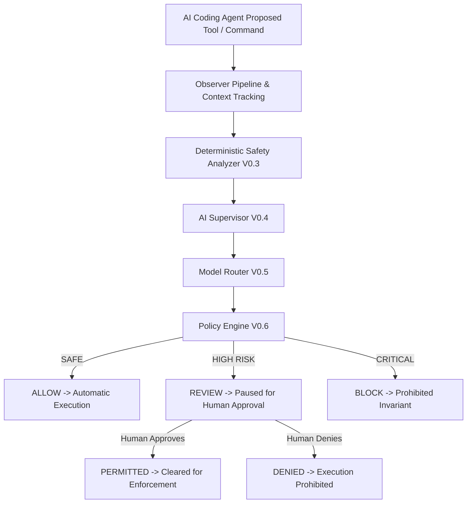

# Aegis

### Human-in-the-Loop Security Layer for AI Coding Agents


Aegis is a local security supervision layer designed to observe AI coding-agent activity, analyze command risk and contextual alignment, enforce policy decisions, and require explicit human approval for risky actions while automatically allowing safe project-relevant operations.

> **Note:** Aegis is designed as a local developer-tool governance boundary. It is not a kernel-level sandbox or process isolation driver.

---

## Overview


AI coding agents can execute shell commands autonomously. Traditional approval models either require constant manual confirmation for every routine command (causing approval fatigue) or give agents unchecked execution authority.

Aegis balances security and productivity through a three-tier decision model:

- **SAFE Actions** → `ALLOW` (Executed automatically without friction)
- **HIGH-RISK Actions** → `REVIEW` (Paused until explicit human authorization)
- **CRITICAL Actions** → `BLOCK` (Prohibited with non-overridable security policy)

---

## Core Security Model



---

## Key Features

- **Real-Time Command Supervision:** Intercepts proposed shell commands prior to execution.
- **Deterministic Risk Analysis:** Scans command patterns, capabilities, and arguments for security risks.
- **Context-Aware AI Supervision:** Analyzes intent alignment against active session context and task goals.
- **Intelligent Model Router:** Directs evaluations through fast heuristic or deep reasoning tiers based on risk score.
- **Human-in-the-Loop Approval:** Holds high-risk actions in `PAUSED_FOR_APPROVAL` until a human approves or denies.
- **Exact-Command Approval Binding:** Approvals are strictly bound to exact normalized command strings (`normalize_command`) and session context.
- **Fail-Closed Architecture:** If the Gateway service is unreachable while protection is `ON`, execution defaults to `FAIL CLOSED` (Exit code 3).
- **Secret Redaction:** Automatically redacts API keys, tokens, and credentials (`[REDACTED_SECRET_KEY]`) before logging or rendering.
- **Local SOC Dashboard:** Real-time web dashboard featuring Dark Obsidian and Warm Off-White/Brown themes, live approval controls, and audit logs.
- **Local-Only Privacy:** Operates entirely on `127.0.0.1` with zero external cloud dependencies or telemetry calls.

---

## Premium Security Operations Center (SOC)

Aegis V1.1 includes a local Security Operations Center web application for real-time observability and human authorization.

### Key SOC Capabilities

- **Overview Dashboard:** Real-time monitoring of Gateway status, protection state, evaluation counters, and active tasks.
- **Human Approval Center:** Detailed explainability cards for pending requests, including risk scores, triggered policy rules, AI verdicts, and single-click `APPROVE` or `DENY` controls.
- **Security Audit Explorer:** Secret-redacted chronological log of evaluated actions with status and risk level filtering.
- **Dual Visual Themes:** Seamless toggle between Dark Obsidian (glassmorphism) and Warm Off-White/Brown themes.

---

## Security Decision Model

| Decision | Risk Level | Gateway Status | Action Taken |
| :--- | :--- | :--- | :--- |
| **ALLOW** | Safe / Low | `PERMITTED` | Cleared for automatic execution. |
| **REVIEW** | High Risk | `PAUSED_FOR_APPROVAL` | Execution paused until human approval. |
| **BLOCK** | Critical | `REJECTED_POLICY` | Execution prohibited by policy invariant. |

---

## Human Approval Lifecycle

```
REVIEW
  ↓
PENDING (Command paused; Exit Code 2 returned to interceptor)
  ↓
HUMAN AUTHORIZATION (Via SOC Dashboard or CLI: python main.py --approve <req_id>)
  ↓
APPROVED (Request status updated in Gateway memory)
  ↓
EXACT COMMAND RESUBMISSION
  ↓
PERMITTED (Gateway matches approved request identity; execution proceeds)
```

> **Approval Binding:** Human authorization is strictly bound to the exact normalized command string and context. Modifying arguments (e.g. changing `--dry-run` to `--force`) invalidates the approval key and requires a new review.

---

## Antigravity Integration & Boundary Limitations

Aegis has experimentally verified interception of the **Antigravity PowerShell execution path** used in Windows environment testing.

### Documented Boundary Limitations

- **PowerShell `-NoProfile` Boundary:** Executing PowerShell with `-NoProfile` bypasses profile-based pre-execution hooks.
- **Interactive Persistent REPL:** Commands entered inside an already-active interactive subshell REPL operate past shell startup and outside the profile boundary.
- **Direct Native Subprocesses:** Aegis does not implement kernel-level drivers or process-injection hooks; native binaries launched directly outside the verified shell profile are not intercepted.
- **Fail-Closed Guarantee:** When Protection is `ON`, any shell command attempting Gateway evaluation while Gateway is offline will fail closed (`Exit 3`).

---

## Installation & Setup

### Prerequisites

- Python 3.10+
- Node.js 18+ (for SOC Dashboard)

### Quickstart

1. **Clone Repository:**
   ```bash
   git clone https://github.com/<your-username>/Aegis.git
   cd Aegis
   ```

2. **Set Up Python Virtual Environment:**
   ```bash
   python -m venv venv
   source venv/bin/activate  # On Windows: venv\Scripts\activate
   pip install -r requirements.txt
   ```

3. **Install Dashboard Dependencies:**
   ```bash
   cd dashboard
   npm install
   cd ..
   ```

---

## Usage

### Start Aegis Gateway Service

```bash
python main.py --start
```

### Install PowerShell Profile Interceptor

```bash
python main.py --install-interceptor
```

### Check Protection Status

```bash
python main.py --protection-status
```

### Launch SOC Dashboard

```bash
python main.py --dashboard
```
*Navigates to `http://localhost:5173`.*

### Human Approval via CLI

```bash
# List pending requests
python main.py --approval-list

# Approve a request
python main.py --approve <REQUEST_ID>

# Deny a request
python main.py --deny <REQUEST_ID>
```

---

## Verification & Testing

Run the comprehensive offline test suite:

```bash
python -m pytest -q
```

**Verified Test Result:**
```
242 passed in 37.10s
```

All 242 tests execute 100% offline with 0 failures and 0 skipped tests.

---

## Security & Disclosure

See [SECURITY.md](SECURITY.md) for full details on threat models, security invariants, secret redaction, and responsible disclosure procedures.

---

## Changelog

See [CHANGELOG.md](CHANGELOG.md) for release history and version highlights.

---

## License

*License details to be specified by maintainer.*
